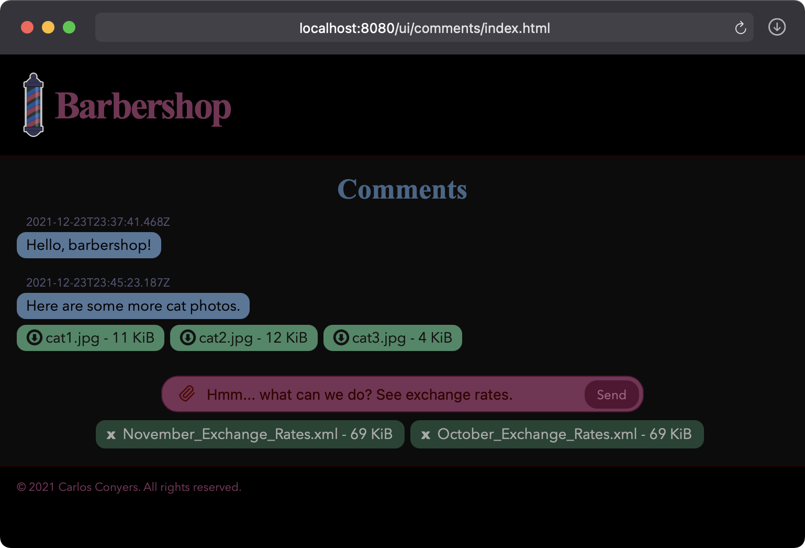

# Barbershop

**Barbershop** is a reference implementation for using [Scamper](https://github.com/losizm/scamper/)
as a web application framework.

## Getting Started

To get started, clone the GitHub repo:

```
git clone 'https://github.com/losizm/barbershop'
```

And, ensure the following are installed locally with their bin directories on
the executable path:

* Java JDK 8 or higher; see [Adoptium](https://adoptium.net) for prebuilt OpenJDK binaries
* The [sbt](https://scala-sbt.org) build tool

## Building Application

**Barbershop** uses the [sbt-native-packager](https://www.scala-sbt.org/sbt-native-packager)
plugin to build the application package.

```sh
sbt packageZipTarball
```

The packager builds a compressed tarball at `[PROJECT]/target/universal/barbershop-[RELEASE].tgz`.

## Installing Application

To install, simply unpackage application to an appropriate directory:

```sh
tar -C [INSTALL_DIRECTORY] -xvf [PROJECT]/target/universal/barbershop-[RELEASE].tgz
```

## Configuring Application

The configuration file is located at `[INSTALL_DIRECTORY]/conf/application.conf`.
This file supplies only a subset of configuration, which includes some basic
settings as shown below.

```conf
barbershop.server.host = 0.0.0.0
barbershop.server.port = 9999
barbershop.server.key = null
barbershop.server.certificate = null
barbershop.server.token = null

include "overrides.conf"
```

The file can be edited to include more settings. Or, alternatively, another file
named `overrides.conf` can be created in the same directory to supply additional
configuration.

See also [reference.conf](src/main/resources/reference.conf) for the complete
set of configuration.

## Running Application

The startup script is located at `[INSTALL_DIRECTORY]/bin/barbershop`.

To start the application, simply run the script:

```sh
[INSTALL_DIRECTORY]/bin/barbershop
```

Or, to start the application while also overriding any number of configuration
settings, supply the key/value pairs as system properties:

```sh
[INSTALL_DIRECTORY]/bin/barbershop -D'barbershop.server.host=localhost' -D'barbershop.server.port=8080'
```

A successful startup prints something like the following to the terminal:

```log
[2021-11-24T03:36:48.445-05:00][INFO] barbershop.web.Server - localhost:8080 - Starting server
[2021-11-24T03:36:48.447-05:00][INFO] barbershop.web.Server - localhost:8080 - Secure: false
[2021-11-24T03:36:48.447-05:00][INFO] barbershop.web.Server - localhost:8080 - Logger: Logger("barbershop.web.Server")
[2021-11-24T03:36:48.447-05:00][INFO] barbershop.web.Server - localhost:8080 - Backlog Size: 20
[2021-11-24T03:36:48.447-05:00][INFO] barbershop.web.Server - localhost:8080 - Pool Size: 4
[2021-11-24T03:36:48.447-05:00][INFO] barbershop.web.Server - localhost:8080 - Queue Size: 16
[2021-11-24T03:36:48.447-05:00][INFO] barbershop.web.Server - localhost:8080 - Buffer Size: 8192
[2021-11-24T03:36:48.447-05:00][INFO] barbershop.web.Server - localhost:8080 - Read Timeout: 250
[2021-11-24T03:36:48.447-05:00][INFO] barbershop.web.Server - localhost:8080 - Header Limit: 20
[2021-11-24T03:36:48.447-05:00][INFO] barbershop.web.Server - localhost:8080 - Keep-Alive: disabled
[2021-11-24T03:36:48.449-05:00][INFO] barbershop.web.Server - localhost:8080 - Server is up and running
```

And, a PID file is created at `[INSTALL_DIRECTORY]/barbershop.pid`.

### How to Use REST API

The application implements a REST API for managing arbitrary comments.

**To create a comment:**

```sh
curl -i -X POST -H'Content-Type: plain/text' -d 'Hello, barbershop!' http://localhost:8080/api/comments
```

The newly created comment's URI is returned in the **Location** header.

**To read a comment:**
```sh
curl http://localhost:8080/api/comments/1
```

Response body is a JSON object.

**To read multiple comments:**
```sh
curl http://localhost:8080/api/comments
```

Response body is a JSON array.

The following query parameters may be supplied in URL to filter comments:

*  `minId` &ndash; lower bound of comment identifier
*  `maxId` &ndash; upper bound of comment identifier
*  `minTime` &ndash; lower bound of comment time; supplied as Epoch milliseconds or timestamp formatted as `yyyy-MM-ddTmm:hh:ssZ`
*  `maxTime` &ndash; upper bound of comment time; supplied as Epoch milliseconds or timestamp formatted as `yyyy-MM-ddTmm:hh:ssZ`
*  `offset` &ndash; number of leading comments to drop
*  `limit` &ndash; maximum number of comments to list

**To update a comment:**
```sh
curl -X PUT -H'Content-Type: plain/text' -d 'HELLO, BARBERSHOP!' http://localhost:8080/api/comments/1
```

**To delete a comment:**
```sh
curl -X DELETE http://localhost:8080/api/comments/1
```

### Visit Comments Page

To view the single-page application, point your browser to
[http://localhost:8080/ui/comments/index.html](http://localhost:8080/ui/comments/index.html).

<div>
  
</div>

Enter a comment and watch it appear in the list. Click on a comment and watch it
disappear from the list.

## Stopping Application

The PID file can be used to stop the application as follows:

```sh
kill "$(< [INSTALL_DIRECTORY]/barbershop.pid)"
```

Or, simply press `Ctrl-C` in the terminal in which the application is running.

## License

**Barbershop** is licensed under the Apache License, Version 2. See [LICENSE](LICENSE)
for more information.
